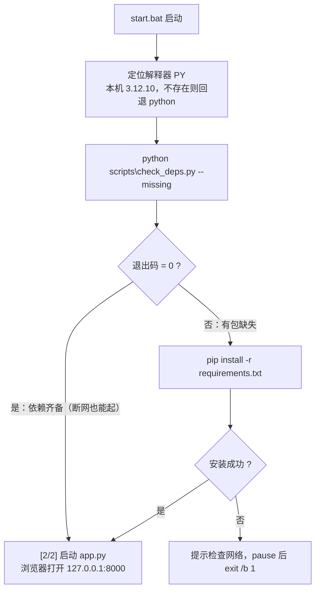

# 设计：锁定依赖版本

> 对应 `requirements.md`。改动面小，但有一处**必须成套落地**的设计约束（§3.1）。

## 1. 改动面

| 文件 | 动作 | 作用 |
|---|---|---|
| `requirements.txt` | 修改 | 4 项运行依赖由下线约束改为 `==` 精确锁定，附改动纪律注释 |
| `requirements-dev.txt` | 新增 | `-r requirements.txt` + `pytest==9.1.1`，把测试框架挡在运行环境之外 |
| `scripts/check_deps.py` | 新增 | 依赖核查：报告模式 / 仅判缺失模式。**纯标准库** |
| `start.bat` | 修改 | 「每次无条件安装」→「先探测、缺了才装」 |
| `tests/test_check_deps.py` | 新增 | 11 例：解析 / 比对 / 命令行 / 守门 |
| `tests/test_startup.py` | 新增 | 4 例：`start.bat` 的编码与启动链路契约 |

**零改动**：`core/`、`app.py`、`templates/`、`static/`、`scripts/` 下其他脚本、`config.json`、`indicators.json`。

改动前后用例数：**252 → 267**（+15）。

## 2. 分层思路

三件事各归其位，**层间只用一个契约：退出码**。

```
① 声明层  requirements.txt / requirements-dev.txt
              ↓ 被读取
② 探测层  scripts/check_deps.py     —— 只回答"现在能不能直接跑"
              ↓ 退出码 0 / 1
③ 执行层  start.bat                 —— 决定"要不要装、装失败了怎么办"
```

设计要点：**"是否安装"的决策留在 `start.bat`，不藏进 Python 脚本**。
`check_deps.py` 做成纯只读的探测器，不具任何副作用 —— 这样可以随时手工执行、
可被 pytest 直接调用，也不会因为误执行而改动用户环境。

## 3. 关键设计决策

### 3.1 pin 与「先探后装」必须成套落地（本设计的核心约束）

由 requirements.md §1.2 的对照表可知：`==` 精确锁定之后，
若 `start.bat` 仍无条件执行 `pip install -r requirements.txt`，
则**每次启动都变成一次联网版本校验**，本机版本与 pin 一旦有偏差，
断网时直接 `exit /b 1` 起不来 —— 可靠性低于改造前。

因此二者**不可拆分**：pin（声明）必须配「探测 + 按需安装」（执行）。
`tests/test_startup.py::test_start_bat_checks_before_installing` 就是把这层耦合固化下来的用例。

### 3.2 只锁直接依赖，不生成全量 `pip freeze`

| 方案 | 优点 | 缺点 | 结论 |
|---|---|---|---|
| 只锁 4 项直接依赖 | 文件可读、意图明确、跨平台装得上 | 传递依赖仍可能漂移 | **采用** |
| `pip freeze` 全量锁 | 完全可复现 | 会把 `pywin32` 等平台专属包、间接依赖一并固化；换机器/Python 版本时反而更易装不上；文件 60+ 行无法人工审阅 | 不采用 |

取舍理由：本项目的实际痛点（§1.1）是「**上游大版本破坏性变更**」，
直接依赖锁定已足以覆盖；为了消除剩余风险而引入全量锁，代价（可维护性、跨机可移植性）
大于收益。若日后确需完全可复现，再评估 `pip-tools` 等方案（属非目标）。

### 3.3 `--missing` 刻意忽略「版本不符」

`--missing` 只回答一个问题：**包在不在**。

| 判定维度 | 报告模式（无参数） | `--missing` 模式 |
|---|---|---|
| 包未安装 | 失败（退出码 1） | **失败**（退出码 1） |
| 包已装但版本不符 | 失败（退出码 1） | **不失败**（退出码 0） |
| 全部一致 | 成功（退出码 0） | 成功（退出码 0） |

为何忽略版本不符：若把它也算失败，则本机版本一旦高于 pin（例如手动升过 `flask`），
**每次启动都会触发联网降级安装**，断网即崩 —— 与 AC-3.2 的初衷背道而驰。
版本一致性由**报告模式**负责（人工执行、可发现），
启动链路只负责"能不能跑"。

`tests/test_check_deps.py::test_main_missing_mode_ignores_mismatch` 固化该行为。

### 3.4 用 `importlib.metadata` 而非 `pkg_resources` / `pip show`

| 方案 | 问题 |
|---|---|
| `pkg_resources` | 自 setuptools 67 起已废弃，未来会被移除；且 import 开销大 |
| 子进程调 `pip show` | 需起进程、按文本解析、慢，且 `pip` 未必在 PATH 上 |
| **`importlib.metadata.version()`** | **标准库、离线、直接返回版本串**；包未装时抛 `PackageNotFoundError`，正好当"缺失"信号 |

副作用：`check_deps.py` 满足约束 C-1（零新增依赖）。

### 3.5 用退出码而非 stdout 文本做层间契约

`start.bat` 判断依赖是否齐备，走的是 `if not errorlevel 1 goto :start`，
而不是去 grep 输出内容。理由：cmd 的文本处理脆弱（编码、引号、管道），
退出码是二进制、跨语言稳定的契约。`--missing` 模式下输出仅在缺失时才打印，
正常情况下 `>nul 2>&1` 完全静默，不污染启动时的控制台。

### 3.6 `start.bat` 保持纯 ASCII

cmd 默认按 **GBK 代码页**解析批处理文件。若写入 UTF-8 中文注释，
字节会被误解为乱码并被当作命令执行，表现为「系统找不到指定的路径」导致启动失败。
故注释统一用英文，并由 `test_start_bat_is_pure_ascii` + `test_start_bat_has_no_bom`
两道用例守住。（现有注释即为此改写成英文。）

## 4. `scripts/check_deps.py` 设计

### 4.1 结构

| 函数 | 职责 | 纯函数 |
|---|---|---|
| `parse_requirements(path) -> (pins, skipped)` | 解析依赖文件，区分「精确锁定行」与「未锁定行」 | ✅ |
| `check(pins) -> [dict]` | 逐包比对实装版本，产出 `name / expected / installed / status` | ✅（`importlib.metadata` 可 monkeypatch） |
| `main(argv)` | 命令行入口：参数解析、输出、退出码 | — |

前两个是纯函数，因此**可以完全离线、不依赖真实环境**地被测试覆盖
（`test_parse_pins_only` 等用例直接喂 `tmp_path` 下的临时文件）。

### 4.2 解析规则

只认 `<包名> == <版本>`（正则 `^([A-Za-z0-9._-]+)\s*==\s*([^\s;#]+)\s*$`）。

| 行形态 | 处理 |
|---|---|
| 空行 | 忽略 |
| `# 注释` | 忽略 |
| `-r other.txt` / `-c ...` / `-e ...` / `--xxx` | 忽略（以 `-` 开头） |
| `requests==2.34.2` | → `pins` |
| `requests==2.34.2  # 行尾注释` | → `pins`（先去行尾注释） |
| `numpy==2.4.6; python_version >= '3.9'` | → `pins`（先去环境标记） |
| `requests>=2.28` / `flask` / `flask~=3.1` | → `skipped`，输出时提示"未纳入核查" |

`skipped` 不参与通过/失败判定，但**必须打印出来**（AC-2.3）——
否则 `>=` 可以被静默写回，核查就形同虚设。

### 4.3 退出码

| 场景 | 退出码 |
|---|---|
| 报告模式：全部匹配 | 0 |
| 报告模式：有缺失或版本不符 | 1 |
| 报告模式：未解析到任何锁定行 | 1 |
| `--missing`：无缺失 | 0 |
| `--missing`：有缺失 | 1 |

## 5. `start.bat` 控制流



与改造前的唯一差别：原来的 `pip install` 是**必经之路**，现在成了**条件分支**。

## 6. 风险与处置

| 风险 | 触发条件 | 处置 |
|---|---|---|
| pin 在目标机上无对应 wheel | 目标机 Python 版本与 3.12.10 差异大（如 3.14） | 安装报错时，先在该版本上把 `pytest` 跑通，再更新 pin；若某包长期无 wheel，单独放宽为 `~=` 并在文件内注明原因 |
| pin 陈旧、漏掉上游安全补丁 | 依赖爆出 CVE | 按 C-5 纪律：升级 → 跑 `pytest` → 更新 pin → 提交（三步缺一不可） |
| 传递依赖仍然漂移 | pip 解析间接依赖 | 已知边界（§3.2），接受。若影响实际使用再评估全量锁 |
| `start.bat` 被记事本另存后破坏编码 | 用记事本编辑保存为 UTF-8 带 BOM | `test_start_bat_is_pure_ascii` / `test_start_bat_has_no_bom` 拦住 |
| `start.bat` 改坏文件引用 | 手误改路径 | `test_start_bat_referenced_files_exist` 拦住 |

## 7. 测试策略

### 7.1 用例分组

| 组 | 用例 | 对应 AC |
|---|---|---|
| 解析 | `test_parse_pins_only`、`test_parse_reports_non_pinned`、`test_parse_missing_file` | AC-2.3 |
| 比对 | `test_check_statuses` | AC-2.1 |
| 命令行 | `test_main_all_ok`、`test_main_reports_mismatch`、`test_main_missing_mode_detects_absent`、`test_main_missing_mode_ignores_mismatch`、`test_main_warns_on_non_pinned`、`test_main_empty_pins_is_failure` | AC-2.1 / 2.2 / 2.4 |
| **守门** | `test_project_requirements_fully_pinned` | AC-4.2 |
| 启动契约 | `test_start_bat_is_pure_ascii`、`test_start_bat_has_no_bom`、`test_start_bat_referenced_files_exist`、`test_start_bat_checks_before_installing` | AC-3.1 / 3.2 / 3.4 / 3.5 |

`tests/test_startup.py` 不执行 `start.bat`（会在测试里常驻一个 web 服务），
而是**读文件字节**做契约断言 —— 覆盖的是"文件是否被改坏"，不是"运行时行为"，
这在离线约束（C-3）下是合理的取舍。

### 7.2 守门用例的意义

`test_project_requirements_fully_pinned` 断言的**不是业务逻辑，而是项目自身的约束**：
`requirements.txt` 里不允许出现非精确锁定行。
没有它，`check_deps.py` 的 `skipped` 提示就只是一句"善意提醒"，
改回 `>=` 不会让任何人变红 —— 这正是本项目反复强调的"假安全"。

### 7.3 有效性自检（「改坏即变红」）

按交付规矩，两道闸都做了反向自检：

| 改坏方式 | 预期变红 | 实测结果 |
|---|---|---|
| `requirements.txt`：`requests==2.34.2` → `requests>=2.28` | `test_project_requirements_fully_pinned` | ✅ `1 failed, 10 passed` |
| `start.bat`：删除 `if not errorlevel 1 goto :start` | `test_start_bat_checks_before_installing` | ✅ `1 failed, 3 passed` |
| 两处恢复后校验 | 文件应与改坏前逐字节一致 | ✅ `sha1sum` 汇总值前后一致（`fd7f2c23…`） |

## 8. 对现有功能的影响

| 面 | 影响 |
|---|---|
| HTTP API | **无**。未新增、未修改任何路由或响应字段 |
| 数据格式 | **无**。缓存文件、`config.json`、`indicators.json` 全未触及 |
| 首次启动 | 依赖缺失时才联网安装（与改造前一致） |
| 日常启动 | **更快更稳**：不再每次 `pip install`；断网可直接启动 |
| 开发流程 | 测试依赖改由 `pip install -r requirements-dev.txt` 一次装齐 |
